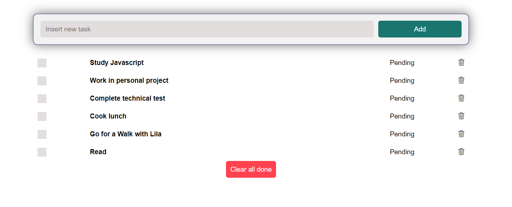
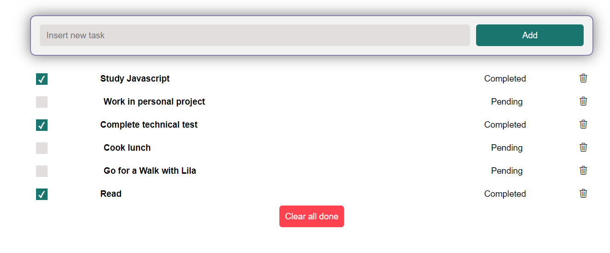
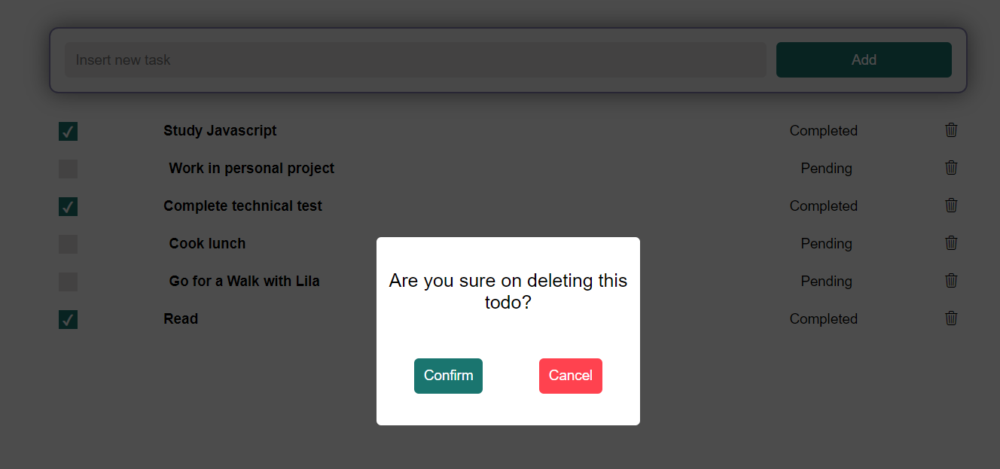

# Todo APP

​

## Table of contents 📄

- [Todo APP](#todo-app)
  - [Table of contents 📄](#table-of-contents-)
  - [Overview :writing_hand:](#overview-writing_hand)
    - [Installation :gear:](#installation-gear)
    - [Screenshot 📷](#screenshot-)
  - [My Process 🏗️](#my-process-️)
    - [Built with 🛠️](#built-with-️)
    - [Useful Resources 📖](#useful-resources-)
  - [Author 👊](#author-)

## Overview :writing_hand:

Todo app allows you to create task lists and save a backup of the data thanks to a REST API that connects to a MongoDB database. As a user, you can list, create, edit, and delete tasks and keep an eye on them.
The application connects to a backend API developed in Express with Typescript to handle data. This repository contains the frontend structure. Here is the link to the backend repository: [Backend Repository](https://github.com/Cristianjs93/todo-api), and the link to the deployed application on Vercel: [Deployed Project]()."

### Installation :gear:

To get started with the project, follow these steps:

1. Clone the repository:

```shell
git clone https://github.com/Cristianjs93/todo-app
```

2. Navigate to the project directory:

```shell
cd todo-app
```

3. Install the dependencies:

```shell
 npm install
```

4. Create the .env file at the root of the project and define the environment variables (refer to the .env.example file for guidance):

```shell
VITE_BASE_URL=https://todo-api-2s3k.onrender.com
```

5. Start the application:

```shell
 npm run dev
```

### Screenshot 📷


<br/>
<br/>

<br/>
<br/>


## My Process 🏗️

### Built with 🛠️

- React: JavaScript library for building interactive user interfaces.
- Redux: A Predictable State Container for JS Apps.
- Sass: CSS preprocessor for easy and organized styling.
- API: The application consumes a backend API developed in Express to manage product data.

### Useful Resources 📖

During the development of this project, the following resources were helpful:

- Official React documentation: https://reactjs.org/docs
- Official Redux documentation: https://redux.js.org/introduction/getting-started
- Official Sass documentation: https://sass-lang.com/documentation

## Author 👊

This project was created by [Cristianjs93](https://github.com/Cristianjs93).
